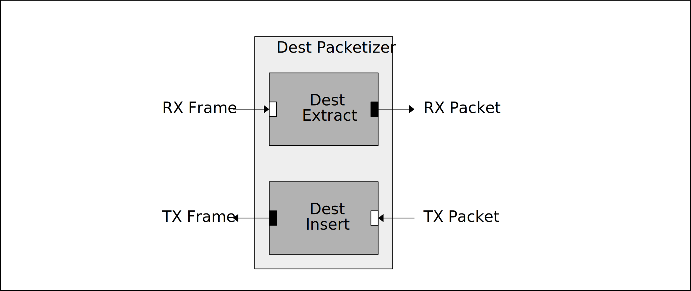

[IP Library](../../doc.md) > Dest Packetizer

# Dest Packetizer

This module consists of 2 sub modules:

- Dest Insert: Inserts TID into AXI4-Stream data packets.
- Dest Extract: Extracts TId from incomming AXI4-Stream data frames.

## Block Diagram

