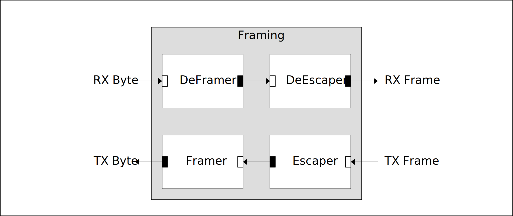

[IP Library](../../doc.md) > Framing

# Framing

This module consists of 2 sub modules:

- Framer: Adds framing bytes to incomming packets
- Deframer: Removes framing bytes from incomming packets

## Block Diagram

## Paramters

| Name | Default | Description |
|------|---------|-------------|
| START_BYTE      | 'h7D      | Byte used to indicate start of packet
| STOP_BYTE       | 'h7E      | Byte used to indicate end of packet
| ESCAPE_BYTE     | 'h7F      | byte used to escape data bytes in packet

## Interfaces

| Name  | Type |        | Description |
|-------|------|--------|-------------|
| rx_byte  | AXI4-Stream | target    |
| rx_frame | AXI4-Stream | initator  |
| tx_byte  | AXI4-Stream | initator  |
| tx_frame | AXI4-Stream | target    |

## Ports

| Name  | Direction | Description |
|-------|-----------|-------------|
| aclk    | in  | AXI Clock.
| aresetn | in  | AXI Reset. This signal is active-Low

