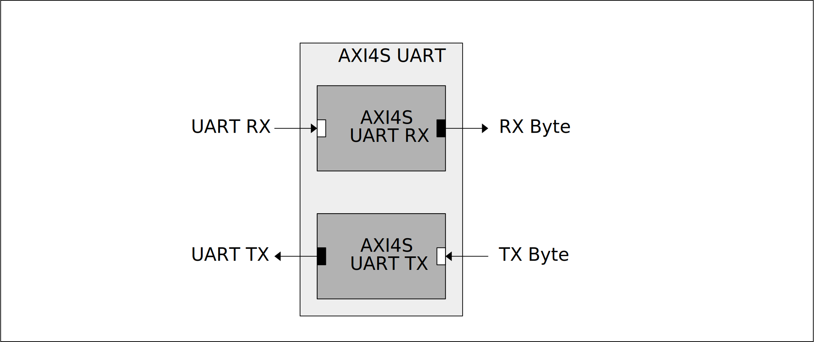

[IP Library](../../doc.md) > AXI4-Stream UART

# AXI4-Stream UART

This module consists of 2 sub modules:

- AXI4-Stream UART TX:
- AXI4-Stream UART RX:

## Block Diagram

## Paramters

| Name | Default | Description |
|------|---------|-------------|
| ACLK_FREQUENCY  | 200000000 | The frequency for the reference AClk [Hz]
| BAUD_RATE       | 9600      | UART baud rate used for synthesis [bits/s]
| BAUD_RATE_SIM   | 50000000  | UART baud rate used for simulation [bits/s](used to reduce simulation time)

## Interfaces

| Name  | Type |        | Description |
|-------|------|--------|-------------|
| uart    | UART         | target    |
| tx_byte | AXI4-Stream  | target    |
| rx_byte | AXI4-Stream  | initator  |

## Ports

| Name  | Direction | Description |
|-------|-----------|-------------|
| aclk    | in  | AXI Clock.
| aresetn | in  | AXI Reset. This signal is active-Low

